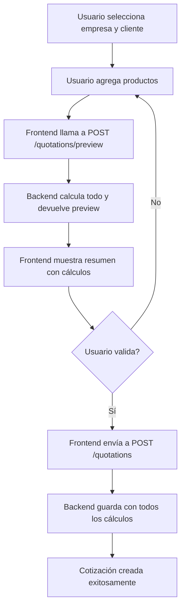

# Cambios en el Sistema de Cotizaciones

## Resumen General

El sistema de cotizaciones ha sido mejorado para almacenar y calcular de manera precisa todos los componentes del cálculo: subtotales, descuentos, logística, IVA y total. Todos los cálculos se realizan ahora del lado del servidor utilizando datos de la empresa, garantizando consistencia y precisión en toda la aplicación.

## ¿Qué Cambió?

### Antes
- Los cálculos se hacían del lado del cliente
- Solo se guardaba el total final
- No había desglose de cómo se calculó el total
- Posibilidad de inconsistencias entre frontend y backend

### Ahora
- **Todos los cálculos se hacen del lado del servidor**
- **Se guardan todos los componentes del cálculo**
- **Nuevo flujo con preview antes de guardar**
- **Validación automática de cálculos**
- **Datos consistentes en toda la aplicación**

---

## Nuevos Campos en la Base de Datos

Se agregaron 7 nuevos campos a la tabla `quotations`:

| Campo | Tipo | Descripción |
|-------|------|-------------|
| `subtotal_productos` | DECIMAL(15,2) | Suma de todos los productos (precio × cantidad) |
| `porcentaje_descuento` | DECIMAL(5,2) | Porcentaje de descuento aplicado (de la empresa) |
| `valor_descuento` | DECIMAL(15,2) | Valor monetario del descuento |
| `valor_logistica` | DECIMAL(15,2) | Costo de logística (de la empresa) |
| `base_gravable` | DECIMAL(15,2) | Base imponible para IVA |
| `porcentaje_iva` | DECIMAL(5,2) | Porcentaje de IVA (19% por defecto) |
| `valor_iva` | DECIMAL(15,2) | Valor monetario del IVA |

### Migración de Base de Datos

```sql
ALTER TABLE quotations
ADD COLUMN subtotal_productos DECIMAL(15, 2) DEFAULT 0,
ADD COLUMN porcentaje_descuento DECIMAL(5, 2) DEFAULT 0,
ADD COLUMN valor_descuento DECIMAL(15, 2) DEFAULT 0,
ADD COLUMN valor_logistica DECIMAL(15, 2) DEFAULT 0,
ADD COLUMN base_gravable DECIMAL(15, 2) DEFAULT 0,
ADD COLUMN porcentaje_iva DECIMAL(5, 2) DEFAULT 19.00,
ADD COLUMN valor_iva DECIMAL(15, 2) DEFAULT 0;
```

**Ubicación del script:** `migrations/add_quotation_calculation_fields.sql`

---

## Lógica de Cálculo

La lógica de cálculo sigue esta fórmula exacta:

```
1. subtotal_productos = Σ(precio_unitario × cantidad)
   Ejemplo: 100,000 × 2 = 200,000

2. porcentaje_descuento = empresa.descuento_base + empresa.descuento_especial
   Ejemplo: 15% (base) + 5% (especial) = 20% total

3. valor_descuento = subtotal_productos × (porcentaje_descuento / 100)
   Ejemplo: 200,000 × 0.15 = 30,000

4. valor_logistica = empresa.valor_logistica
   Ejemplo: 50,000

5. base_gravable = subtotal_productos - valor_descuento + valor_logistica
   Ejemplo: 200,000 - 30,000 + 50,000 = 220,000

6. porcentaje_iva = 19% (fijo hasta que cambie nacionalmente)

7. valor_iva = base_gravable × 0.19
   Ejemplo: 220,000 × 0.19 = 41,800

8. total = base_gravable + valor_iva
   Ejemplo: 220,000 + 41,800 = 261,800
```

### Suma de Descuentos

El sistema **suma ambos descuentos** de la empresa:
- `descuento_base` (ej: 15%)
- `descuento_especial` (ej: 5%)
- **Total:** 15% + 5% = 20%

Si alguno no existe o es 0, simplemente se suma el otro.

---

## Gestión de Crédito

### Información en Preview

El endpoint `/quotations/preview` ahora incluye **información completa del crédito** de la empresa:

```json
{
  "company": {
    "credit": {
      "has_credit": true,              // Booleano: ¿Tiene crédito?
      "available_credit": 500000,      // Crédito disponible actual
      "total_credit": 1000000,         // Crédito total otorgado
      "spent_credit": 500000           // Crédito ya gastado
    }
  }
}
```

**Cálculo del crédito disponible:**
```
available_credit = total_credit - spent_credit
```

### Deducción Automática al Crear Cotización

Cuando se crea una cotización con `POST /quotations`, el sistema automáticamente:

1. **Deduce del crédito**: Suma el total de la cotización al `saldo_gastado` de la empresa
2. **Registra en audit**: Crea un registro detallado del cambio de crédito
3. **Continúa la operación**: Aunque el crédito sea insuficiente, la cotización se crea (solo advertencia)

**Ejemplo:**
```
Empresa:
- saldo_credito (total): $1,000,000
- saldo_gastado (antes): $500,000
- available_credit: $500,000

Nueva cotización: $249,900

Después de crear:
- saldo_gastado (después): $749,900
- available_credit: $250,100
```

### Registro de Auditoría

Cada deducción de crédito se registra en `audit_logs` con:

```json
{
  "action_type": "update",
  "entity_type": "company",
  "userId": "uuid-creador",
  "entityId": "uuid-empresa",
  "details": {
    "action": "credit_deduction",
    "reason": "quotation_created",
    "quotation_id": "uuid-cotizacion",
    "quotation_total": 249900,
    "previous_spent_credit": 500000,
    "new_spent_credit": 749900,
    "available_credit_before": 500000,
    "available_credit_after": 250100
  },
  "metadata": {
    "quotation_number": "uuid-cotización",
    "company_name": "Empresa S.A."
  }
}
```

---

## Nuevo Flujo de Trabajo

### Frontend: Flujo Completo



### Paso a Paso

#### 1. Preview (No guarda en BD)
```javascript
// Llamada al endpoint de preview
POST /quotations/preview
{
  "company_id": "uuid-empresa",
  "user_id": "uuid-cliente",
  "products": [
    {
      "product_id": "uuid-producto",
      "quantity": 2,
      "unit_price": 100000
    }
  ],
  "validity_days": 15,
  "term": "30",
  "creation_mode": "MANUAL",
  "created_by": "uuid-creador"
}
```

#### 2. Mostrar Preview al Usuario
El backend devuelve todos los cálculos desglosados.

#### 3. Guardar (después de validación)
```javascript
// Usar el preview response para crear
POST /quotations
{
  "quotation": {
    "company_id": "uuid-empresa",
    "user_id": "uuid-cliente",
    "validity_days": 15,
    "term": "30",
    "creation_mode": "MANUAL",
    "created_by": "uuid-creador",
    "total": 261800,
    // Campos de cálculo del preview
    "subtotal_productos": 200000,
    "porcentaje_descuento": 15,
    "valor_descuento": 30000,
    "valor_logistica": 50000,
    "base_gravable": 220000,
    "porcentaje_iva": 19,
    "valor_iva": 41800
  },
  "details": [
    {
      "product_id": "uuid-producto",
      "quantity": 2,
      "unit_price": 100000,
      "discount": 0,
      "subtotal": 200000,
      "taxes": 0
    }
  ]
}
```

---

## Endpoints de la API

### POST /quotations/preview

**Propósito:** Calcular y mostrar el desglose de una cotización sin guardarla en la base de datos.

**Request:**
```json
{
  "company_id": "string (UUID)",
  "user_id": "string (UUID)",
  "products": [
    {
      "product_id": "string (UUID)",
      "quantity": "number",
      "unit_price": "number"
    }
  ],
  "validity_days": "number",
  "term": "string",
  "creation_mode": "MANUAL | AUTOMATIC",
  "created_by": "string (UUID)"
}
```

**Response:**
```json
{
  "company": {
    "id": "string",
    "name": "string",
    "credit": {
      "has_credit": true,
      "available_credit": 500000,
      "total_credit": 1000000,
      "spent_credit": 500000
    }
  },
  "user": {
    "id": "string",
    "name": "string"
  },
  "products": [
    {
      "id": "string",
      "name": "string",
      "quantity": 2,
      "unit_price": 100000,
      "discount": 0,
      "subtotal": 200000,
      "taxes": 0
    }
  ],
  "expiration_date": "2025-12-30T00:00:00.000Z",
  "validity_days": 30,
  "term": "Net 30",
  "creation_mode": "MANUAL",
  "created_by": {
    "id": "string",
    "name": "string"
  },
  "calculations": {
    "subtotal_productos": 200000,
    "porcentaje_descuento": 20,
    "valor_descuento": 40000,
    "valor_logistica": 50000,
    "base_gravable": 210000,
    "porcentaje_iva": 19,
    "valor_iva": 39900,
    "total": 249900
  }
}
```

**Códigos de Estado:**
- `200 OK` - Preview generado exitosamente
- `404 Not Found` - Empresa o usuario no encontrado
- `400 Bad Request` - Datos inválidos

---

### POST /quotations (ACTUALIZADO)

**Propósito:** Crear y guardar una cotización con todos los cálculos.

**Cambios:**
- Ahora acepta campos de cálculo en `quotation`
- Guarda todos los campos en la base de datos
- Valida que los cálculos sean correctos

**Request:**
```json
{
  "quotation": {
    "company_id": "string",
    "user_id": "string",
    "validity_days": 30,
    "term": "string",
    "creation_mode": "MANUAL",
    "created_by": "string",
    "total": 261800,
    "subtotal_productos": 200000,
    "porcentaje_descuento": 15,
    "valor_descuento": 30000,
    "valor_logistica": 50000,
    "base_gravable": 220000,
    "porcentaje_iva": 19,
    "valor_iva": 41800
  },
  "details": [
    {
      "product_id": "string",
      "quantity": 2,
      "unit_price": 100000,
      "discount": 0,
      "subtotal": 200000,
      "taxes": 0
    }
  ]
}
```

**Response:**
```json
{
  "id": "uuid-cotizacion",
  "company_id": "string",
  "user_id": "string",
  "creation_date": "2025-11-30T00:00:00.000Z",
  "expiration_date": "2025-12-30T00:00:00.000Z",
  "validity_days": 30,
  "term": "Net 30",
  "status": "PENDING",
  "creation_mode": "MANUAL",
  "created_by": "string",
  "total": 261800,
  "subtotal_productos": 200000,
  "porcentaje_descuento": 15,
  "valor_descuento": 30000,
  "valor_logistica": 50000,
  "base_gravable": 220000,
  "porcentaje_iva": 19,
  "valor_iva": 41800,
  "details": [...]
}
```

---

### GET /quotations/:id (ACTUALIZADO)

**Cambios:**
- Ahora devuelve todos los campos de cálculo
- Permite auditar cómo se calculó cada cotización

**Response:** Igual que POST pero incluye campos de cálculo.

---

### GET /quotations (ACTUALIZADO)

**Cambios:**
- Lista devuelve campos de cálculo para cada cotización
- Permite mostrar desglose en tablas/listas

---

## Arquitectura del Backend

### Nuevos Archivos

1. **`quotation-calculation.service.ts`**
   - Servicio dedicado a cálculos
   - Método `calculateQuotation()` - calcula todo el desglose
   - Método `validateCalculation()` - valida cálculos del cliente

2. **`migrations/add_quotation_calculation_fields.sql`**
   - Script de migración para agregar campos

### Archivos Modificados

1. **`quotation.entity.ts`**
   - Agregados campos de cálculo a interface `Quotation`
   - Nuevo DTO: `PreviewQuotationRequestDto`
   - Nuevo interface: `QuotationCalculationBreakdown`
   - Actualizado: `CreateQuotationResponseDto`

2. **`quotation.controller.ts`**
   - Nuevo endpoint: `POST /quotations/preview`
   - Inyección de `QuotationCalculationService`

3. **`quotation-crud.service.ts`**
   - Nuevo método: `generatePreview()`
   - Inyección de `QuotationCalculationService`

4. **`quotation-db.service.ts`**
   - Query INSERT actualizado con nuevos campos
   - Query SELECT devuelve nuevos campos

5. **`quotation.module.ts`**
   - Registrado `QuotationCalculationService` en providers

---

## Guía de Integración Frontend

### 1. Actualizar Formulario de Creación

```typescript
// Paso 1: Obtener preview
const previewData = {
  company_id: selectedCompany.id,
  user_id: selectedUser.id,
  products: selectedProducts.map(p => ({
    product_id: p.id,
    quantity: p.quantity,
    unit_price: p.price
  })),
  validity_days: 30,
  term: 'Net 30',
  creation_mode: 'MANUAL',
  created_by: currentUserId
};

const preview = await fetch('/quotations/preview', {
  method: 'POST',
  headers: { 'Content-Type': 'application/json' },
  body: JSON.stringify(previewData)
});

const previewData = await preview.json();

// Paso 2: Mostrar desglose al usuario
console.log('Calculations:', previewData.calculations);
// {
//   subtotal_productos: 200000,
//   porcentaje_descuento: 15,
//   valor_descuento: 30000,
//   valor_logistica: 50000,
//   base_gravable: 220000,
//   porcentaje_iva: 19,
//   valor_iva: 41800,
//   total: 261800
// }

// Paso 3: Si usuario acepta, crear
const createData = {
  quotation: {
    ...previewData, // Incluye todos los cálculos
    // Extraer calculations y ponerlos en el nivel superior
    ...previewData.calculations,
    total: previewData.calculations.total
  },
  details: selectedProducts.map(p => ({
    product_id: p.id,
    quantity: p.quantity,
    unit_price: p.price,
    discount: 0,
    subtotal: p.quantity * p.price,
    taxes: 0
  }))
};

const result = await fetch('/quotations', {
  method: 'POST',
  headers: { 'Content-Type': 'application/json' },
  body: JSON.stringify(createData)
});
```

### 2. Mostrar Desglose en UI

```typescript
// Componente de Preview
function QuotationPreview({ calculations }) {
  return (
    <div className="quotation-breakdown">
      <h3>Desglose de Cotización</h3>
      
      <div className="line-item">
        <span>Subtotal Productos:</span>
        <span>${calculations.subtotal_productos.toLocaleString()}</span>
      </div>
      
      <div className="line-item discount">
        <span>Descuento ({calculations.porcentaje_descuento}%):</span>
        <span>-${calculations.valor_descuento.toLocaleString()}</span>
      </div>
      
      <div className="line-item">
        <span>Logística:</span>
        <span>+${calculations.valor_logistica.toLocaleString()}</span>
      </div>
      
      <div className="line-item subtotal">
        <span>Base Gravable:</span>
        <span>${calculations.base_gravable.toLocaleString()}</span>
      </div>
      
      <div className="line-item">
        <span>IVA ({calculations.porcentaje_iva}%):</span>
        <span>+${calculations.valor_iva.toLocaleString()}</span>
      </div>
      
      <div className="line-item total">
        <span><strong>Total:</strong></span>
        <span><strong>${calculations.total.toLocaleString()}</strong></span>
      </div>
    </div>
  );
}
```

---

## Validación y Testing

### Casos de Prueba

#### Test 1: Cálculo Básico
```
Producto: $100,000 × 2 = $200,000
Descuento: 15% = -$30,000
Logística: $50,000
Base Gravable: $220,000
IVA 19%: $41,800
Total: $261,800 ✓
```

#### Test 2: Sin Descuento
```
Producto: $150,000 × 1 = $150,000
Descuento: 0% = $0
Logística: $30,000
Base Gravable: $180,000
IVA 19%: $34,200
Total: $214,200 ✓
```

#### Test 3: Múltiples Productos
```
Producto A: $50,000 × 3 = $150,000
Producto B: $75,000 × 2 = $150,000
Subtotal: $300,000
Descuento: 10% = -$30,000
Logística: $40,000
Base Gravable: $310,000
IVA 19%: $58,900
Total: $368,900 ✓
```

### Comando de Testing

```bash
# Test manual con curl
curl -X POST http://localhost:3000/quotations/preview \
  -H "Content-Type: application/json" \
  -d '{
    "company_id": "uuid-empresa",
    "user_id": "uuid-usuario",
    "products": [
      {"product_id": "uuid-producto", "quantity": 2, "unit_price": 100000}
    ],
    "validity_days": 30,
    "term": "Net 30",
    "creation_mode": "MANUAL",
    "created_by": "uuid-creador"
  }'
```

---

## Beneficios de los Cambios

### Para el Negocio
✅ **Auditoría completa** - Cada cotización guarda cómo se calculó  
✅ **Consistencia de datos** - Los mismos datos en toda la app  
✅ **Transparencia** - El cliente ve el desglose completo  
✅ **Confiabilidad** - Cálculos server-side no manipulables  

### Para Desarrollo
✅ **Menos bugs** - Un solo lugar para cálculos  
✅ **Más fácil debugging** - Logs detallados de cálculos  
✅ **Validación automática** - El server valida todo  
✅ **Código mantenible** - Lógica centralizada  

### Para el Usuario
✅ **Mayor confianza** - Ven exactamente qué se cobra  
✅ **Preview antes de crear** - Validan antes de confirmar  
✅ **Datos correctos** - No hay errores de redondeo  

---

## Preguntas Frecuentes

### ¿Qué pasa con las cotizaciones existentes?
Las cotizaciones anteriores tendrán valores `0` o `NULL` en los nuevos campos. El frontend debe manejar este caso mostrando "N/A" o calculando sobre la marcha (solo para visualización).

### ¿El IVA siempre será 19%?
Por ahora sí, está hardcodeado. Cuando cambie nacionalmente, se debe actualizar en `quotation-calculation.service.ts` línea 87.

### ¿Puedo crear sin usar preview?
Sí, pero debes enviar todos los campos de cálculo. Se recomienda siempre usar preview primero.

### ¿Se validan los cálculos al crear?
Actualmente no, pero el método `validateCalculation()` existe y puede ser integrado.

### ¿Qué descuento se usa?
Se **suman** ambos descuentos: `descuento_base + descuento_especial`. Si la empresa tiene 15% base y 5% especial, el total aplicado será 20%.

---

## Resumen Técnico

- **7 nuevos campos** en tabla `quotations`
- **1 nuevo servicio** `QuotationCalculationService`
- **1 nuevo endpoint** `POST /quotations/preview`
- **3 endpoints actualizados** para devolver campos de cálculo
- **Migración SQL** proporcionada y lista para ejecutar
- **100% server-side** cálculos garantizados correctos

---

**Última actualización:** 30 de noviembre de 2025  
**Versión:** 1.0.0  
**Autor:** Sistema de Desarrollo
